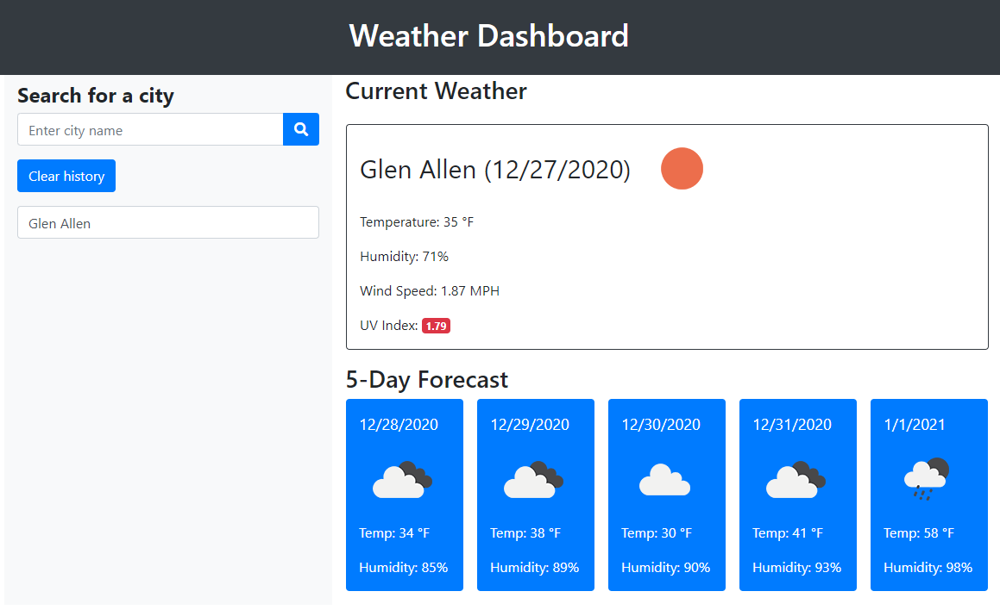

# Weather Dashboard

This app will use the [OpenWeather API](https://openweathermap.org/api) to retrieve weather data for requested cities.

## Description

When a user initiates the webpage, the OpenWeatherMap API will lookup their coordinates and allowing of the location tracker to run, their current location will be output into the Weather Dashboard. 

Anytime a user inputs a city name into the search feature the AJAX call will lookup the current and 5-day forecasted weather of the requested city.

The Current Weather widget will show the selected city, current date and an image of the weather. It will also show temperature, humidity, wind speed and uv-index of the city.

The 5-Day Forecast will show the next 5 days after the current day in individual cards. Each card will have the date, the weather picture, temperature, and humidity.

As the user searches for different city names, each city name will be stored in localStorage. As the localStorage is set, the form below the Clear History button will populate with the city name. When the city name is selected the Weather Dashboard will be updated accordingly.

If the user wishes to clear the history of their city searches, they may use the Clear History button. Clicking on this button will remove all the cities from the stored array and the localStorage.

Anytime a user reloads the page the current location call is made to look up the user's coordinates and fetch the current weather.

## Link to Site

https://codragon2020.github.io/weather_dashboard/

This site was made with:

## Screenshots

